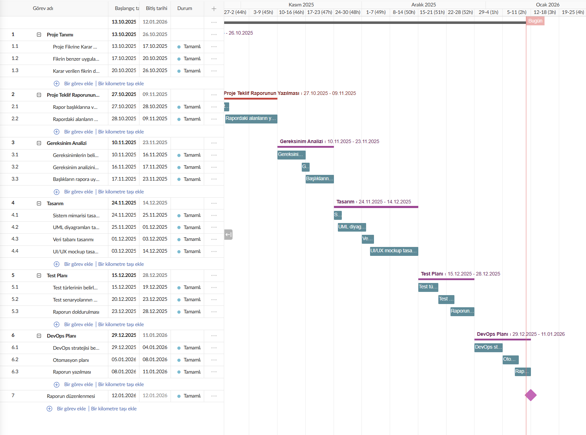

# 6.Proje Yönetimi Dokümanları
Bu bölüm, OleAI bitirme projesi için hazırlanan final raporundaki **6. Proje Yönetimi** kısmının rapora sığmayan tablo ve dokümanların bir örneğini tutmak için kullanılan dosyadır.

---

## 6.2 Zaman Planlaması ve Görev Yönetimi - Gantt Chart:

---

## 6.3 Görev Dağılımı ve Versiyon Kontrolü: 

### 6.3.1 Görev Dağılımı: 

| Aşama | Görev | Sorumlu |
| :--- | :--- | :--- |
| **Analiz** | Gereksinimlerin analiz edilmesi ve sistem kapsamının belirlenmesi | Proje Geliştiricisi |
| **Analiz** | Fonksiyonel ve fonksiyonel olmayan gereksinimlerin tanımlanması | Proje Geliştiricisi |
| **Tasarım** | Sistem mimarisinin ve katmanlı yapının tasarlanması | Proje Geliştiricisi |
| **Tasarım** | UML diyagramlarının (Use Case, Class, Sequence) hazırlanması | Proje Geliştiricisi |
| **Tasarım** | Veritabanı yapısının ve veri modelinin tasarlanması | Proje Geliştiricisi |
| **Tasarım** | UI/UX mockuplarının tasarımı | Proje Geliştiricisi |
| **Planlama** | Zaman planlamasının oluşturulması ve Gantt Chart hazırlanması | Proje Geliştiricisi |
| **Test** | Test planının ve test senaryolarının oluşturulması | Proje Geliştiricisi |
| **Test** | Test süreçlerinin dokümante edilmesi | Proje Geliştiricisi |
| **DevOps** | DevOps stratejisinin ve CI/CD sürecinin planlanması | Proje Geliştiricisi |
| **DevOps** | Otomasyon, izleme ve güvenlik yaklaşımlarının planlanması | Proje Geliştiricisi |
| **Raporlama** | Teknik raporların hazırlanması | Proje Geliştiricisi |
| **Raporlama** | Proje dokümantasyonunun sonlandırılması ve teslim | Proje Geliştiricisi |

---
